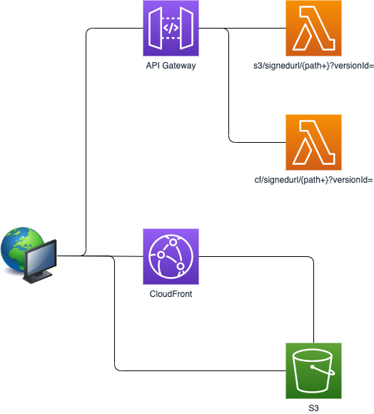

Examples using S3
=================



#Building and Deployment

```
cd deploy
(cd ..; \
AWS_REGION=ap-northeast-1 \
KEY_PAIR_ID=<YOUR KEY ID> \
KEY_BUCKET_NAME=<YOUR BUCKET NAME> \
KEY_FILE=<YOUR KEY FILE PATH> \
DOMAIN_NAME=example.com \
mvn clean package); \
KEY_PAIR_ID=<YOUR KEY ID> \
KEY_BUCKET_NAME=<YOUR BUCKET NAME> \
KEY_FILE=<YOUR KEY FILE PATH> \
sls deploy -s test -r ap-northeast-1 -v
```

This application details are available on the [Medium](https://medium.com/@shigeki-shoji/how-to-access-versioning-enabled-s3-buckets-with-signed-url-776ec5331a0e).
