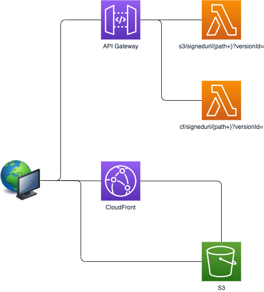

Examples using S3
=================



# Building and Deployment

See: [Specifying the signers that can create signed URLs and signed cookies](https://docs.aws.amazon.com/AmazonCloudFront/latest/DeveloperGuide/private-content-trusted-signers.html)

```
$ openssl genrsa -out private_key.pem 2048
$ openssl rsa -pubout -in private_key.pem -out public_key.pem
```

```
AWS_REGION=us-east-1 \
KEY_PAIR_ID=<YOUR KEY ID> \
KEY_BUCKET_NAME=<YOUR BUCKET NAME> \
KEY_FILE=<YOUR KEY FILE PATH> \
DOMAIN_NAME=example.com \
mvn clean package

KEY_GROUP=<YOUR KEY GROUPS ID> \
KEY_PAIR_ID=<YOUR KEY ID> \
KEY_BUCKET_NAME=<YOUR BUCKET NAME> \
KEY_FILE=<YOUR KEY FILE PATH> \
../npm run deploy
```

```
aws cloudfront sign --url https://dju74f8c9avbq.cloudfront.net/index.html \
   --key-pair-id KVFXXXXXXXXX \
   --private-key file://private_key.pem \
   --date-less-than 2020-10-23T19:30:00+09:00 \
```

This application details are available on the [Medium](https://medium.com/@shigeki-shoji/how-to-access-versioning-enabled-s3-buckets-with-signed-url-776ec5331a0e).
